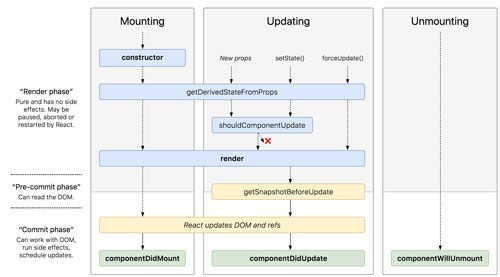
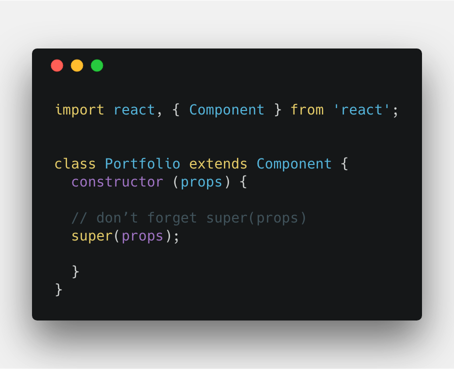
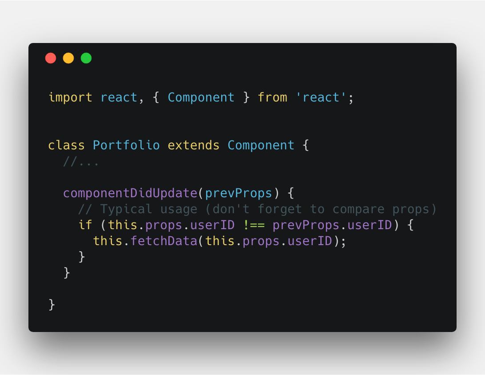

[View this post on Medium](https://medium.com/@_ChrisBradshaw/blogdidmount-2018-guide-to-react-component-lifecycle-methods-1614e0bbe80a)

**_Source:_** <http://projects.wojtekmaj.pl/react-lifecycle-methods-diagram/>

<h4>Why use component lifecycle methods:</h4>

* AJAX functionality
* Performance Enhancement (free up resources taken by the components when they are destroyed)

<iframe src="https://giphy.com/embed/Wde8IvMfYILSM" width="480" height="333" frameBorder="0" class="giphy-embed" allowFullScreen></iframe>
<a href="https://giphy.com/gifs/disney-the-lion-king-circle-of-life-Wde8IvMfYILSM">via GIPHY</a>

<h2>Commonly Used Lifecycle Methods</h2>

<h3> Mounting Methods</h3>

_Mounting_ is when a component is rendered to the DOM for the first time.

1.  **constructor()** - in general, there are two reasons to use a React Constructor:

<ul>
<li>Set up your components initial state</li>
<li>Bind event handler methods to an instance</li>
</ul>

**Use setState?** No, use this.state in the constructor.

2.  **render()** - if you've written even one React component, you are familiar with render, the only method you *must* define in a React.Component. The render function does not modify component state, it returns the same result each time it's invoked, and it does not directly interact with the browser. Examines this.props and this.state to return one of the following:

<ul>
<li>React Elements (JSX)</li>
<li>Arrays and Fragments</li>
<li>Portals</li>
<li>Strings/numbers</li>
<li>Booleans or null</li>
</ul>

_**Note:** If you need to interact with the browser, use componentDidMount instead - keep render pure._

**Can use setState here?** No.

<iframe src="https://giphy.com/embed/l0HlHAORavTWG7864" width="480" height="270" frameBorder="0" class="giphy-embed" allowFullScreen></iframe>
<a href="https://giphy.com/gifs/thebachelorette-the-bachelorette-l0HlHAORavTWG7864">via GIPHY</a>

3.  **componentDidMount()**- this method runs immediately after the component output has been rendered to the DOM. It will not get run in node but will in the browser. This makes it so your component can render first then you can go get the data you need. In your component, you can throw up a loader during this time. Also if you need to interact with the DOM (like if you were wrapping D3) this would be the place to do it. Furthermore, if you need to load data from a remote endpoint this is a good place to instantiate the network request.

**Can use setState here?** Yes, but in most cases you should be able to assign the initial state in the contructor() instead. Be careful - calling setState in componentDidMount can cause performance issues. In some cases it may be necessary - like modals and tooltips.

<h3>Updating Methods</h3>

4.  **componentDidUpdate()** - this method is invoked immediately after updating occurs on renders after the first render (where it's _NOT_ called). It's a good place to do network requests as long as you compare the current props to previous props (e.g. a network request may not be necessary if the props have not changed).

**Example**

**Call setState()?** you may call setState() in componentDidUpdate() but note that it must be wrapped in a condition or you will cause an infinite loop. Can also cause performance issues.

<h3>Unmounting Methods</h3>

5.  **componentWillUnmount()** - this method runs right before the component is taken off the DOM. Most common thing to do here is get rid of external event listeners or other things you need to clean up.

**Can call setState()?** No. This is where the component is being terminated.

<h3>Rarely used Component Lifecycle Methods</h3>

6.  **static_getDerivedStateFromProps()** - exists for where the state depends on changes in props over time. For example, it might be handy for implementing a Transition component that compares its previous and next children to decide which of them to animate in and out. If you need to perform a side effect (for example, data fetching or an animation) in response to a change in props, use the [componentDidUpdate()](https://reactjs.org/docs/react-component.html#componentdidupdate) lifecycle instead.

**Resource:** [You Probably Don't Need Derived State](https://reactjs.org/blog/2018/06/07/you-probably-dont-need-derived-state.html#what-about-memoization)

<iframe src="https://giphy.com/embed/syCa5ird7wp0c" width="480" height="269" frameBorder="0" class="giphy-embed" allowFullScreen></iframe>
<a href="https://giphy.com/gifs/update-syCa5ird7wp0c">via GIPHY</a>

7.  **shouldComponentUpdate()** - this method returns a boolean letting React know if it should re-render the component. This is for performance purposes. If you have a component that will never update (like a static logo or something) you can just return false here.

    <ul>
      <li>React is pretty fast at doing this anyway</li>
      <li><b>render()</b>, <b>componentDidUpdate()</b>, and <b>UNSAFE_componentWillUpdate()</b> will not be invoked if <b>shouldComponentUpdate()</b> returns false.</li>
    </ul>
     

8.  **getSnapshotBeforeUpdate()** - in rare use cases, getSnapshotBeforeUpdate() enables your component to capture some information from the DOM (e.g. scroll position) before it is potentially changed. A snapshot value (or null) should be returned.

9.  **componentDidCatch()** - React components that define this life cycle method become **Error Boundaries**. React components that catch JavaScript errors anywhere in their child component tree, log those errors, and display a fallback UI instead of the component tree that crashed. **Error Boundaries** catch errors during rendering, in lifecycle methods, and in constructors of the whole tree below them.

**Resource:** [Error Handling in React](https://reactjs.org/blog/2017/07/26/error-handling-in-react-16.html)

<h3>Soon to be deprecated React Lifecycle methods</h3>

10. **UNSAFE_componentWillMount()** - This method runs right before the component gets mounted. Use componentDidMount() instead.

11. **UNSAFE_componentWillReceiveProps()** - This method runs every time the React component receives new/different props from the parent. If some of the state you keep in your component is derived from the parent props, this is where you would take care of that. What if you keep a list of actors in a movie as state that you request from an API? If your parent passes you a new movie, you need to react to that and get new actors for the new movie. This would be an example of where to use this method. Use [componentDidUpdate](https://reactjs.org/docs/react-component.html#componentdidupdate) lifecycle instead.

<h3>Sources:</h3>

<https://reactjs.org/docs/state-and-lifecycle.html>

<https://reactjs.org/docs/react-component.html>
